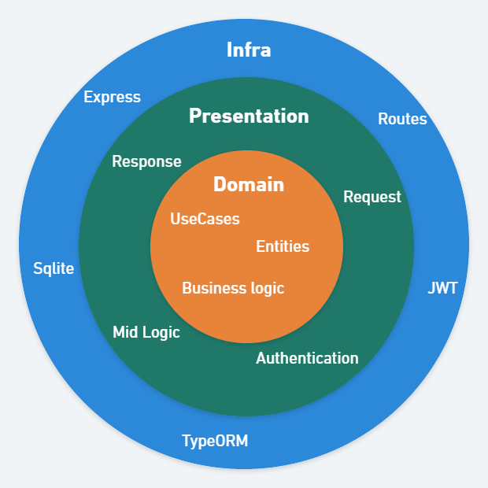

# Kanban API

An API to handle with Kanban cards

## Features

-   Login with username (login field) and password
-   JWT authentication
-   CRUD for cards
-   REST API

## Used technologies

-   Node.js
-   Express.js
-   Jwt
-   Typeorm
-   Sqlite

## Code details

This project was created with an architecture based on 3 layers: domain, presentation and infra. These three layers have separated responsabilities.
Thus layer communication is done with one-side only as domain never calls any infra or controller resource. This fits the onion architecture concept.



### Domain

Domain layer contains all business logic, including entities contracts, usecases and classes for error handling.

### Presentation

In presentation layer the API requests were abstracted. Request validation and response data mappers are some of the features in this section.
Also, there are middlewares logic and error handling.

### Infra

Every external communication was done on Infra layer. In order to connect with sqlite database, a typeorm connection was established. Also, JWT service with jsonwebtoken was created.

## Run Locally

Clone the project

```bash
  git clone https://github.com/pviniciusm/kanban.git
```

Go to the API project directory

```bash
  cd kanban/api
```

Copy .env.example to a .env file and fill required data

```bash
    JWT_SECRET_KEY=
    API_PORT=
    LOGIN=
    PASSWORD=
```

Required data are:

-   JWT_SECRET_KEY: a text to use as jwt secret key
-   API_PORT: the port where express server must run
-   LOGIN: login username to use on authentication
-   PASSWORD password to use on authentication

Install dependencies

```bash
  npm install
```

Start the server

```bash
  npm run dev
```

## Entrypoints

The API entrypoints are defined as following:

```bash
    (POST)      /login

    (GET)       /cards
    (POST)      /cards
    (PUT)       /cards/{id}
    (DELETE)    /cards/{id}
```

## Next steps

These are the next steps of this project:

    [ ] Add user CRUD
    [ ] Integrate user - login
    [ ] Add integration tests with supertest
    [ ] Create a real database connection
    [ ] Add docker to init database
